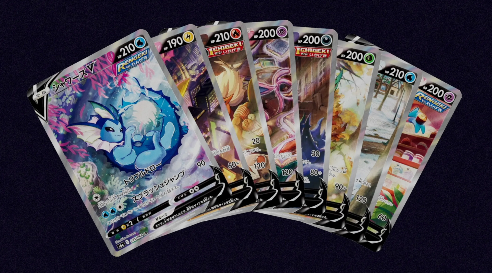
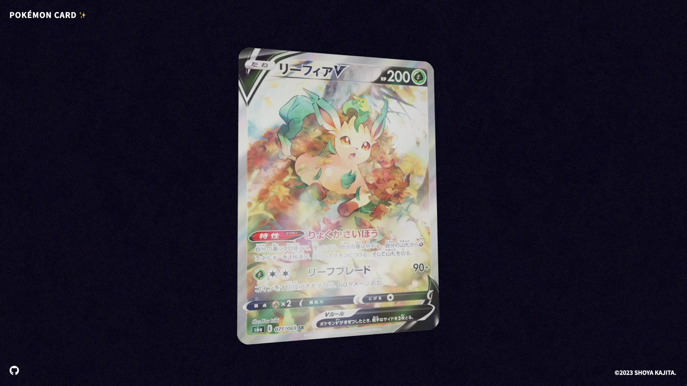
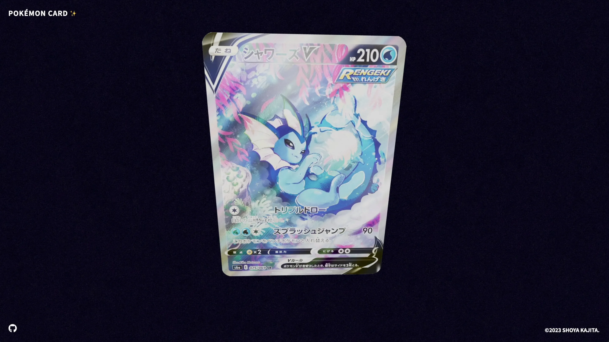
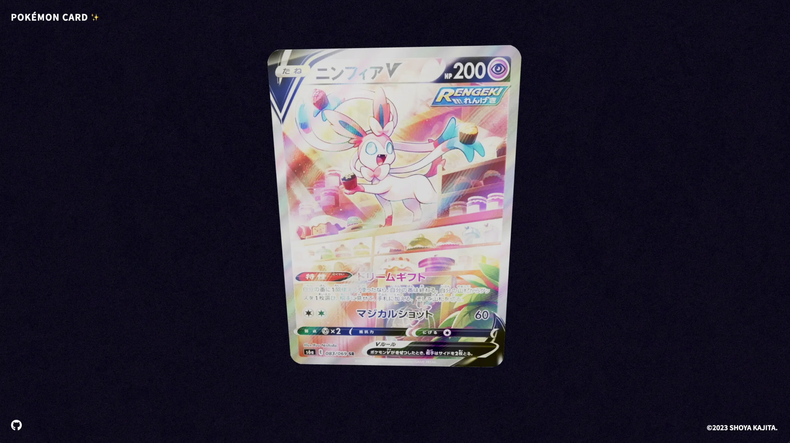
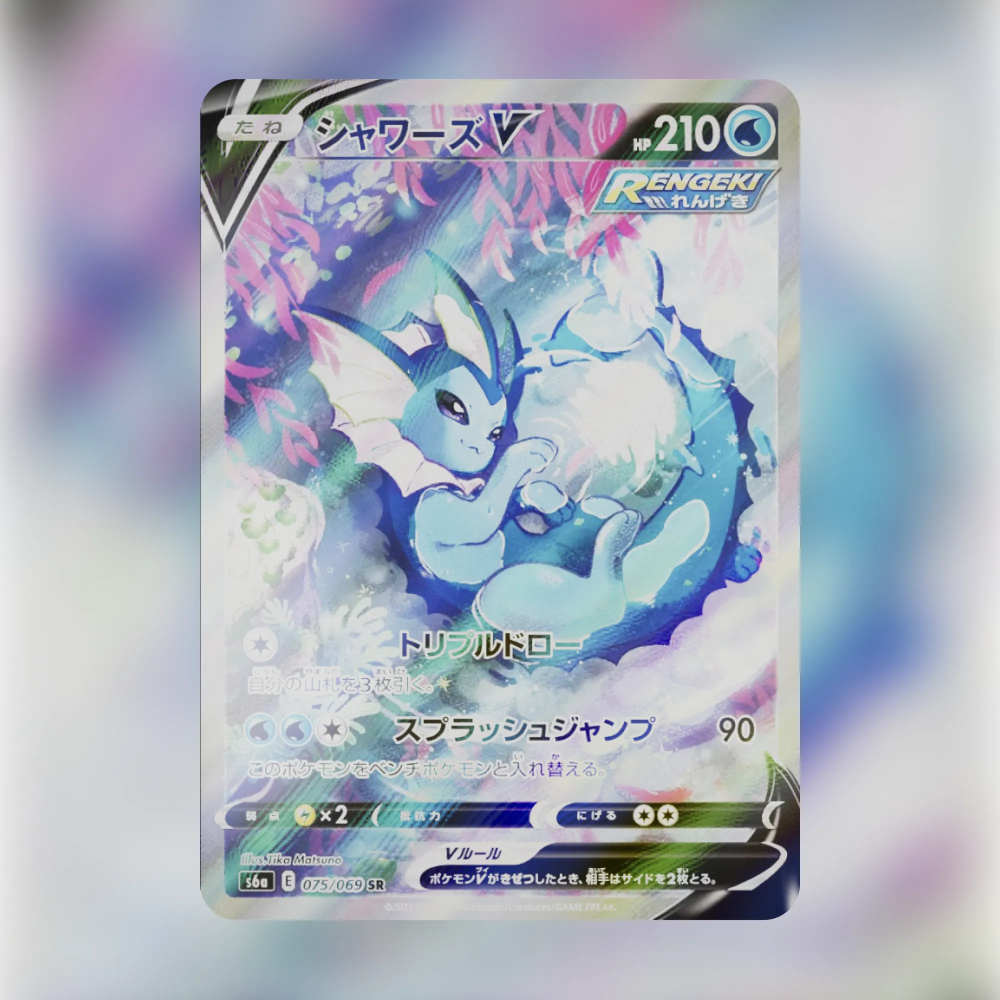
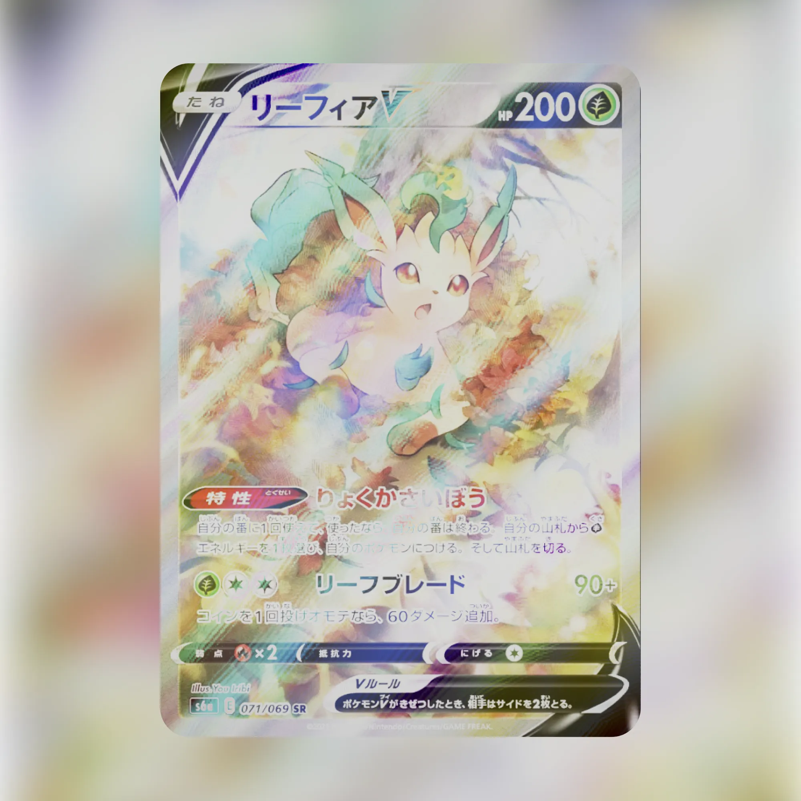
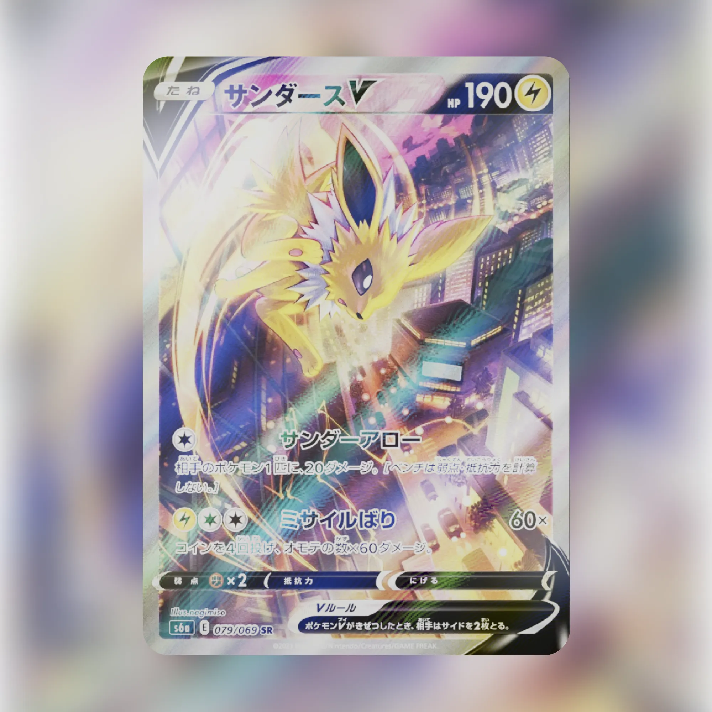

# Toys.036 | GLSL School Task.02 ~ Pokémon Cards Holographic Effect

## 🪬 ~ 課題内容

今回の課題は、テクスチャを使った表現に挑戦してみましょう。

## 👾 ~ Demo

- https://dev.shoya-kajita.com/036/









## 🎮 ~ Getting Started

- node: v18.15.0
- npm: 9.5.0

```
// install
npm i

// development
npm run dev

// production
npm run build

// build preview
npm run preview
```

## 🧐 ~ Reference

- https://github.com/jamieowen/glsl-blend
- https://poke-holo.simey.me/
- https://docs.pokemontcg.io/
- https://codepen.io/simeydotme/pen/abYWJdX
- https://github.com/PokemonTCG/pokemon-tcg-sdk-javascript
